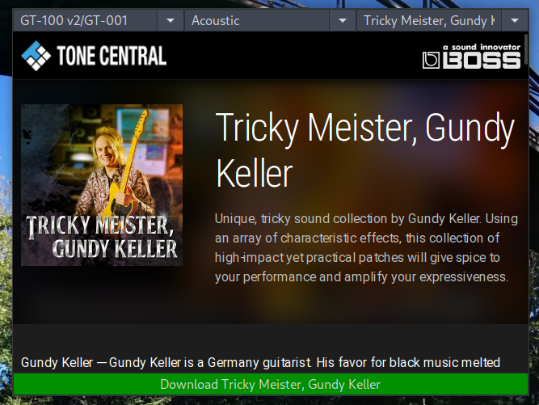

# BossToneCentral downloader

Download any patches for any proc from bosstonecentral.
It's very useful when you using fxfloorboard.



* Select proc
* Select genre
* Select patch
* Download

File can be found in current application directory or in path from your .desktop file (See below).

## OS requirements

```bash
$ sudo dnf install python3-wxpython4-webview python3-wxpython4 
```

## Proc settings mapping

```
GT-100 v2/GT-001 => gt.json
GT-1 => gt-1.json
Katana => katana.json
Katana Air => katana-air.json
GT-1000 => gt-1000.json
GP-10 => gp-10.json
ME-80 => me-80.json
ME-25 => me-25.json
```

## Manual download instruction

Download two files
```
define=http://api.roland.com/app/btc/define/ + settings_for_your_proc
apps=define.btc.domain + define.btc.dataapi
```

Your can download any patches with next path

```
define.btc.domain + define.btc.liveset_file + apps.items.basename + '.tsl'
```

## Desktop entry

```
[Desktop Entry]
Type=Application
Name=BOSS ToneCentral downloader
GenericName=BOSSToneCentralDownloader
Comment=Download patches from boss tonecentral
Exec=downloaded-repository-path/download.py
Path=your-path-to-save-patches
Terminal=false
Categories=Audio;
```

